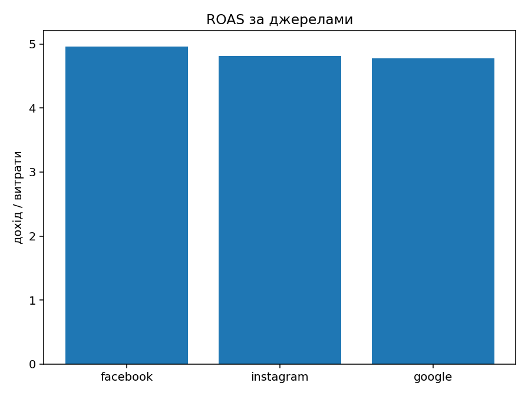
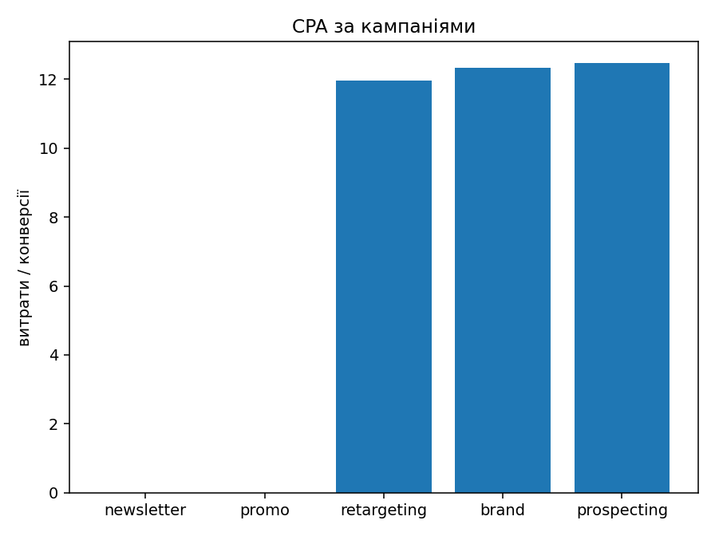

# Моє портфоліо дата-аналітика (маркетинг)

Я — Junior Data Analyst (Python/SQL). Люблю робити дані зрозумілими для бізнесу: зібрати, порахувати ключові показники і показати, що саме варто змінити.

## Проєкт 1 — Marketing Analytics (UTM)

**Що це?** Невеликий аналіз рекламних джерел і кампаній на штучних даних (без ризику для NDA з попередньої стажування).  
**Мета:** швидко побачити, де реклама працює краще, а де — зливає бюджет.

**Що я зробив**
- Імпортував дані (джерело, канал, кампанія; кліки/сесії/витрати/конверсії/дохід).
- Порахував ключові метрики:
  - Конверсія = `conversions / sessions`
  - CPA (вартість за конверсію) = `cost / conversions`
  - ROAS (дохід на 1 грн витрат) = `revenue / cost`
  - Середній чек = `revenue / conversions`
- Зібрав підсумки по **джерелах** і **кампаніях**, побудував графіки.

### Візуалізації
  

### Коротко про результат
- Найвищий ROAS у: **facebook** (за цим набором даних).
- Найнижчий CPA — у кампанії **prospecting** (краще залучення за вартістю).
- Канал **email** у цьому датасеті без витрат, тому ROAS для нього не рахується — це нормально.

### Як відтворити у мене локально
1. Покласти `data/raw/marketing_utm_sample.csv`.  
2. Відкрити `notebooks/01_marketing_dashboard.ipynb` і виконати всі клітинки.  
3. Графіки збережуться в `reports/images/`.

### Структура
da-portfolio/
├─ data/
│  ├─ raw/ **вихідні дані (CSV, XLSX тощо)**
│  └─ processed/ **оброблені файли**
├─ notebooks/ **Jupyter-ноутбуки для аналізу**
├─ src/ **Python-скрипти**
├─ reports/
│  └─ images/ **графіки, скріни**
└─ dashboards/ **лінки чи експорт дашбордів**